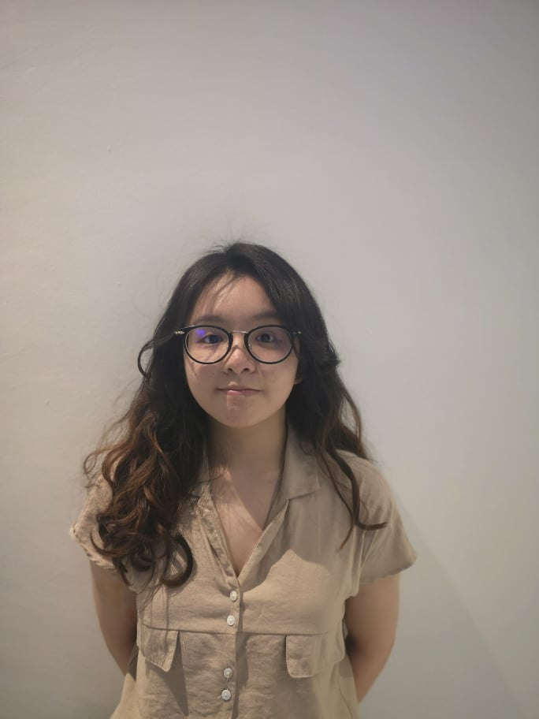

<h1 align="center"> Here our Team Members Profile </h1>

        

            

               <h1 align ="Center"> MEET   THE TEAM </h1>
            

                

                    

                        

                            
                            <ul class="social">
                                <li></li>
                                <li></li>
                                <li></li>
                                <li></li>
                            </ul>
                        

                        

                            <h3 class="title">UGWUEKE CHIDUBEM EMMANUEL </h3>
                            

                            <b>Zhejiang University </b> 
                            
                            MPS Industrial Design Engineer  
                            Sep 2022 - Present  
                            
                                

                            Group Leader                       
                             

[MORE DETAILS](AboutUs/AUGY.md)                                                                               
                        

                    

                

                

                    

                        

                            
                            <ul class="social">
                                <li></li>
                                <li></li>
                                <li></li>
                                <li></li>
                            </ul>
                        

                        

                            <h3 class="title">Abdiaziz Omar Hassan</h3>
                            

                            <b>Zhejiang University </b> 
                            MPS Industrial Design Engineer  
                         Sep 2022 - Present  
                         
                         M.sc Information Security |2022  
                         B.sc Telecommunication Engineer | 2018
                         

                            Member

[MORE DETAILS](AboutUs/Mahir.md)
                        

                    

                

                    

                        

                            
                            <ul class="social">
                                <li></li>
                                <li></li>
                                <li></li>
                                <li></li>
                            </ul>
                        

                        

                            <h3 class="title">WALUSIMBI PETER </h3>
                            

                            <b>Zhejiang University </b> 
                            
                            MPS Industrial Design Engineer  
                            Sep 2022 - Present  
                            Bs.c Civil Engineering
                            
                                

                            Structural Engineer

[MORE DETAILS](AboutUs/Peter.md)
                        

                    

                

            

            

                

                    

                        

                            
                            <ul class="social">
                                <li></li>
                                <li></li>
                                <li></li>
                                <li></li>
                            </ul>
                        

                        

                            <h3 class="title">LIM WIN KEE</h3>
                             <b>Zhejiang University </b> 
                             
                          MPS Industrial Design Engineer  
                           Sep 2022 - Present  
                          
                          B.sc Architecture Engineer | 
                           

                            Project Designer

[MORE DETAILS](AboutUs/Winke.md)
                        

                    

                

                    

                        

                            
                            <ul class="social">
                                <li></li>
                                <li></li>
                                <li></li>
                                <li></li>
                            </ul>
                        

                        

                            <h3 class="title">OMAR KHALED QASEM AHMED AL-SHAQDARI </h3>
                            

                            <b>Zhejiang University </b> 
                          
                          MPS Industrial Design Engineer  
                          Sep 2022 - Present  
                          
                          B.sc Machanical Engineer |
                           

                            Engineer

[MORE DETAILS](AboutUs/khaled.md)
                        

                    

                

                    

                        

                            
                            <ul class="social">
                                <li></li>
                                <li></li>
                                <li></li>
                                <li></li>
                            </ul>
                        

                        

                            <h3 class="title">Abdirahim Omar Hirsi </h3>
                          

                          <b>Zhejiang University </b> 
                          
                          MPS Industrial Design Engineer  
                          Sep 2022 - Present  
                           
                           B.sc Machanical Engineer | 2019
                          

                            3D Designer

[MORE DETAILS](AboutUs/Hirsi.md)
                        

                    

                

            

            

                

                    

                        

                            
                            <ul class="social">
                                <li></li>
                                <li></li>
                                <li></li>
                                <li></li>
                            </ul>
                        

                        

                            <h3 class="title">MOHAMMED ABDO HASAN QAID KHALED </h3>
                          

                          <b>Zhejiang University </b> 
                          
                          MPS Industrial Design Engineer  
                           Sep 2022 - Present  
                           
                          B.sc Machanical Engineer |
                          

                            Fusion Designer

[MORE DETAILS](AboutUs/qaid.md)
                        

                    

                

                    

                        

                            
                            <ul class="social">
                                <li></li>
                                <li></li>
                                <li></li>
                                <li></li>
                            </ul>
                        

                        

                           <h3 class="title">MOHAMMED HAMOUD GHANEM </h3>
                          

                          <b>Zhejiang University </b> 
                           
                          MPS Industrial Design Engineer  
                          Sep 2022 - Present  
                          
                          B.sc Machanical Engineer |
                          

                            B.sc Machanical Eng

[MORE DETAILS](AboutUs/weal.md)
                        

                    

                

                    

                        

                            
                            <ul class="social">
                                <li></li>
                                <li></li>
                                <li></li>
                                <li></li>
                            </ul>
                        

                        

                            <h3 class="title">RABARISON ANDRY ERIC A </a></h3>
                          

                          <b>Zhejiang University </b> 
                          
                          Digital Media Designer 
                          Sep 2022 - Present  
                          
                          Designer, Aviation Professional|
                          
 
                            Digital Media Designer

[MORE DETAILS](AboutUs/AN.md)
                        

                    

                

            

        

    

 
