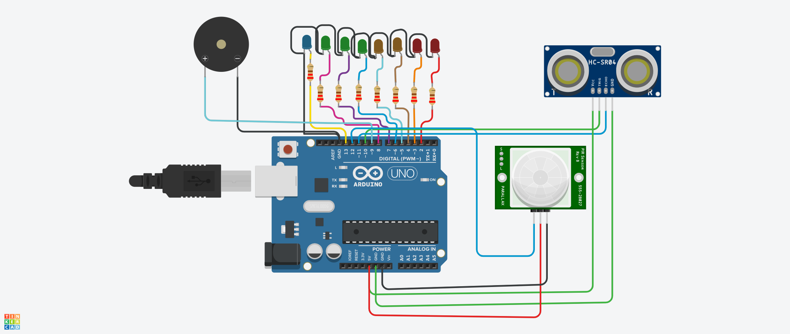
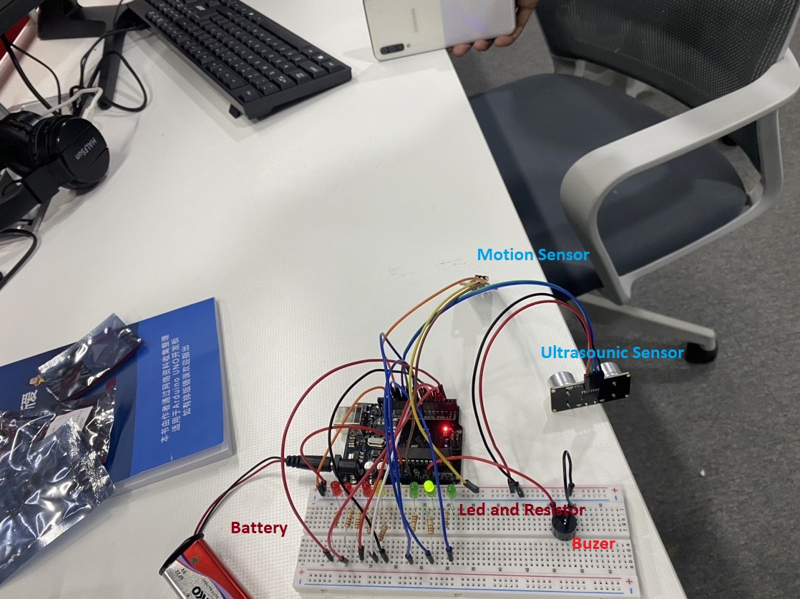
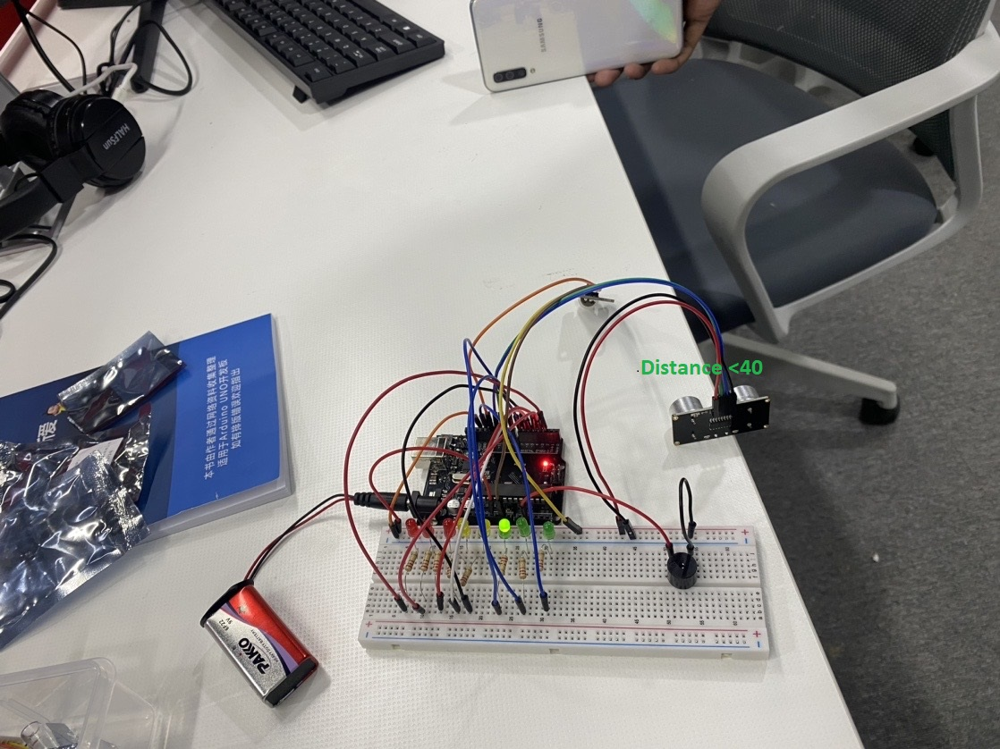
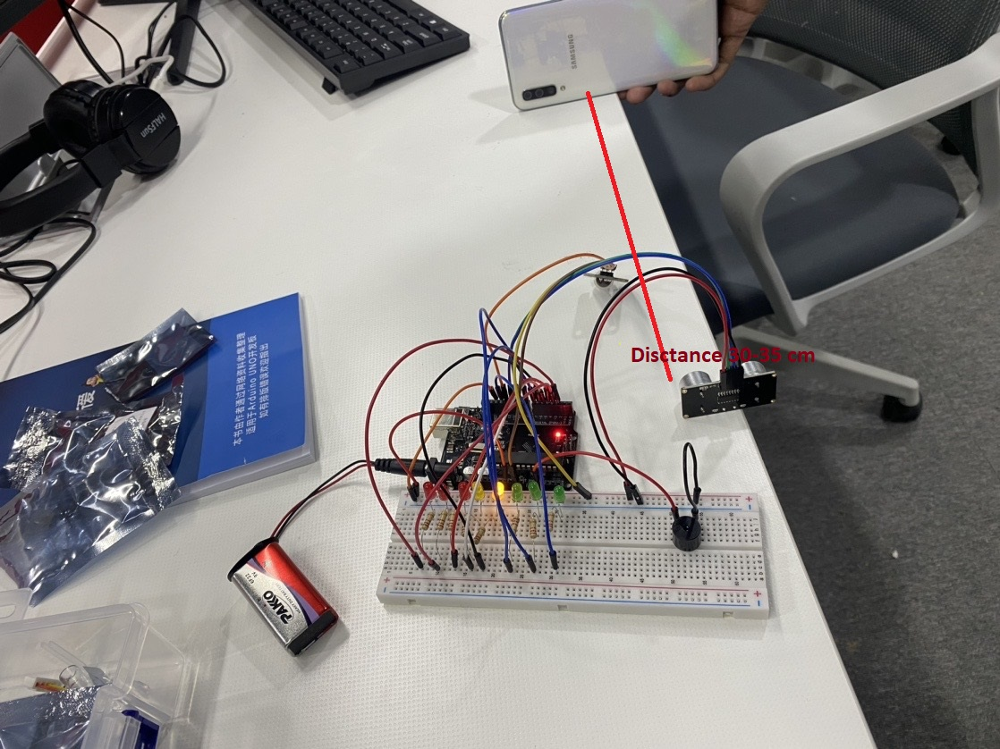
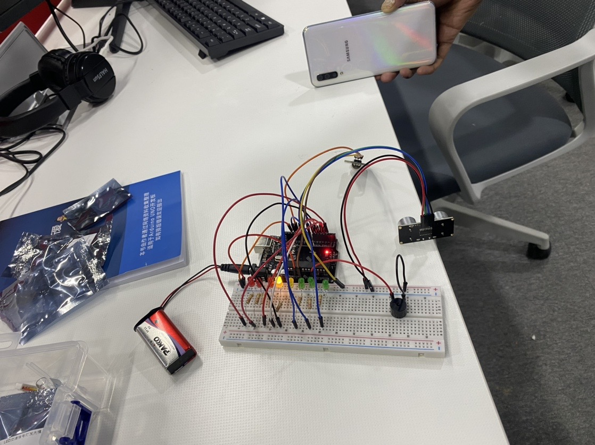
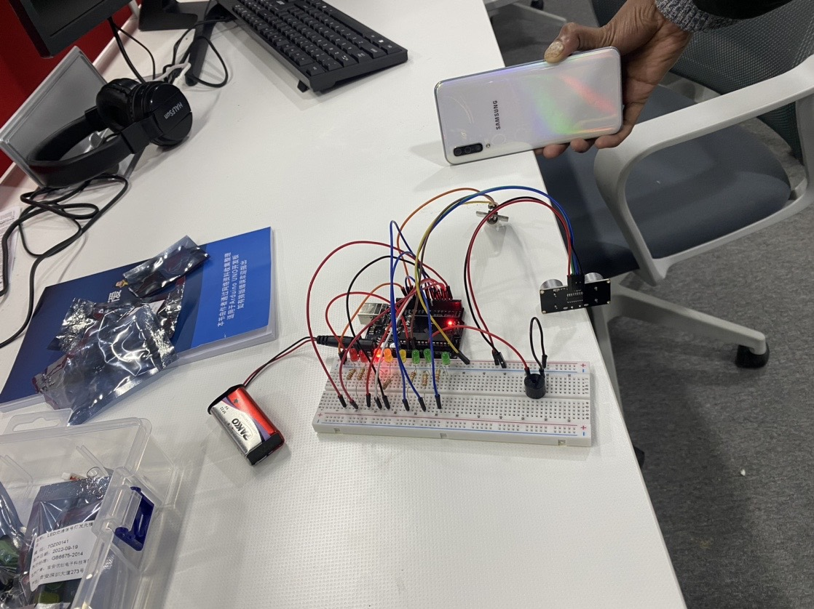
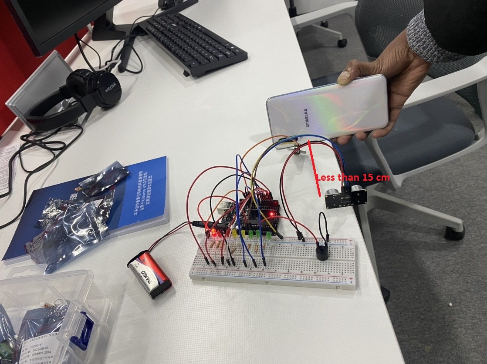

<h3 style="font-size:5vw; text-align:left" > Arduino Projects</h3>

<h1> First program: <span style = "color:blue" >Car Parking Alarm </span></h1>
<p class="p2"> ABOUT THIS PROJECT </p>
<p class="p1" style="text-align:justify;">

Ultrasonic Distance Sensor - <b>HC-SR04</b> was utilized in conjunction with an Arduino system.

Sensor Ultrasonic The duration between emission and reception is used by ultrasonic sensors to calculate the distance to the target. A transmitter and receiver are used in an optical sensor, but an ultrasonic sensor employs a single ultrasonic element for both emission and reception. </p>

## CODE

```Arduino
/*
 * Ultrasonic Simple
 * Prints the distance read by an ultrasonic sensor in
 * centimeters. They are supported to four pins ultrasound
 * sensors (liek HC-SC04) and three pins (like PING)))
 * and Seeed Studio sensors).
 *
 * The circuit:
 * * Module HR-SC04 (four pins) or PING))) (and other with
 *   three pins), attached to digital pins as follows:
 * ---------------------    --------------------
 * | HC-SC04 | Arduino |    | 3 pins | Arduino |
 * ---------------------    --------------------
 * |   Vcc   |   5V    |    |   Vcc  |   5V    |
 * |   Trig  |   12    | OR |   SIG  |   13    |
 * |   Echo  |   13    |    |   Gnd  |   GND   |
 * |   Gnd   |   GND   |    --------------------
 * ---------------------
 * Note: You do not obligatorily need to use the pins defined above
 * 

#include <Ultrasonic.h>

const int LED1 = 8;
const int LED2 = 7;
const int LED3 = 6;
const int LED4 = 5;
const int LED5 = 4;
const int LED6 = 3;
const int LED7 = 2;
//const int LED8 = 9;
int ledPin = 13;
int inPin = 12;
int buttonState;
const int pazer = 13;

/*
 * Pass as a parameter the trigger and echo pin, respectively,
 * or only the signal pin (for sensors 3 pins), like:
 * Ultrasonic ultrasonic(13);
 */
Ultrasonic ultrasonic(10, 11);
int distance;

void setup() {
  pinMode(LED1 , OUTPUT);
  pinMode(LED2 , OUTPUT);
  pinMode(LED3 , OUTPUT);
  pinMode(LED4 , OUTPUT);
  pinMode(LED5 , OUTPUT);
  pinMode(LED6 , OUTPUT);
  pinMode(LED7 , OUTPUT);
  //pinMode(LED8 , OUTPUT);
  pinMode(ledPin,OUTPUT);
  pinMode(inPin,INPUT);
   pinMode(pazer,OUTPUT);

  Serial.begin(9600);
}

void loop() {
  // Pass INC as a parameter to get the distance in inches
  distance = ultrasonic.read();
  
  Serial.print("Distance in CM: ");
  Serial.println(distance);
  delay(1000);

  if ( distance >= 40)          
  {
    digitalWrite(LED1, HIGH);
  }
  else
  {
    digitalWrite(LED1, LOW);
  }
  if ( distance >= 35 && distance < 40 )
  {
    digitalWrite(LED2, HIGH);
  }
  else
  {
    digitalWrite(LED2, LOW);
  }
  if ( distance >= 30 && distance < 35 )
  {
    digitalWrite(LED3, HIGH );
  }
  else
  {
    digitalWrite(LED3, LOW);
  }
  if ( distance >= 25 && distance < 30)
  {
    digitalWrite(LED4, HIGH );
  }
  else
  {
    digitalWrite(LED4, LOW);
  }
  if ( distance >= 20  && distance < 25)
  {
    digitalWrite(LED5, HIGH );
  }
  else
  {
    digitalWrite(LED5, LOW);
  }
  if ( distance >= 15 && distance < 20)
  {
    digitalWrite(LED6, HIGH );
  }
  else
  {
    digitalWrite(LED6, LOW);
  }
  if ( distance >= 0 && distance <= 15)
  {
    digitalWrite(LED7, HIGH);
    digitalWrite(pazer, HIGH);
  }
  else
  {
    digitalWrite(LED7, LOW);
    digitalWrite(pazer, LOW);
  }
  buttonState = digitalRead(inPin);
  if(buttonState == HIGH)
  {digitalWrite(ledPin,HIGH);
  delay(3000);
  }
  else(buttonState ==LOW);{
  digitalWrite(ledPin,LOW);
  Serial.println(buttonState);// put your main code here, to run repeatedly:
  }

}
```

## SCHEMATICS




### OUTPUT








<video width="320" height="240" poster="img/download.png" controls>
   <source src="img/cpk1.mp4" type="video/mp4">
   <source src="movie.ogg" type="video/ogg">
</video>

 <h1> LCD control by Push button </h1>

> Project requirements

1- LCD Display  16*2 <br>
2- Arduino board Uno <br>
3- Female or Male Connection <br>
4- Push Button  <br>

``` Arduino
#include <LiquidCrystal.h>
const int rs = 12, en = 11, d4 = 5, d5 = 4, d6 = 3, d7 = 2;
LiquidCrystal lcd(rs, en, d4, d5, d6, d7);

void setup() 
{
  lcd.begin(16, 2);
  lcd.print("team-4,ZJU");
  lcd.setCursor(0,1);
  lcd.print("Mohammed22251414");
  delay(1000);
}

void loop() 
{
  for (int i=0;i<15;i++) 
  { 
    lcd.scrollDisplayLeft();
    delay(150);
  }
  
  for (int j=0;j<34;j++)
  {
    lcd.scrollDisplayRight();
    delay(150);
  }
  
  delay(1000);

} 

```
#### Output

### Second program 

```Arduino
#include <LiquidCrystal.h>
#define pb 7
#define gnd 8
const int rs = 12, en = 11, d4 = 5, d5 = 4, d6 = 3, d7 = 2;
LiquidCrystal lcd(rs, en, d4, d5, d6, d7);

void setup() 
{
  lcd.begin(16, 2);
  pinMode(pb,INPUT_PULLUP);
  pinMode(gnd,OUTPUT);
  digitalWrite(gnd,LOW);
  lcd.print("Push Button"); 
}

void loop() 
{
  if(digitalRead(pb)==LOW)
  {
    lcd.setCursor(0,1);
    lcd.print("OFF ");
  }else
  {
    lcd.setCursor(0,1);
    lcd.print("ON");
  }
}
```
#### Output

### Class Work
led controll by Push Button <br>

<div class="responsive">
  <div class="gallery">
    <a target="_blank" href="img/32.jpg">
     <video width="320" height="240" poster="img/download.png" controls>
   <source src="img/arduino.mp4" type="video/mp4">
   <source src="movie.ogg" type="video/ogg">
</video>
    </a>
    <div class="desc">Led </div>
  </div>
</div>
<div class="clearfix"></div>

<br>