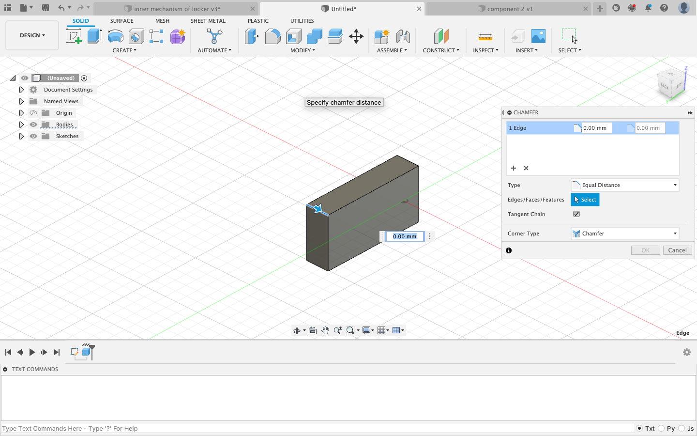
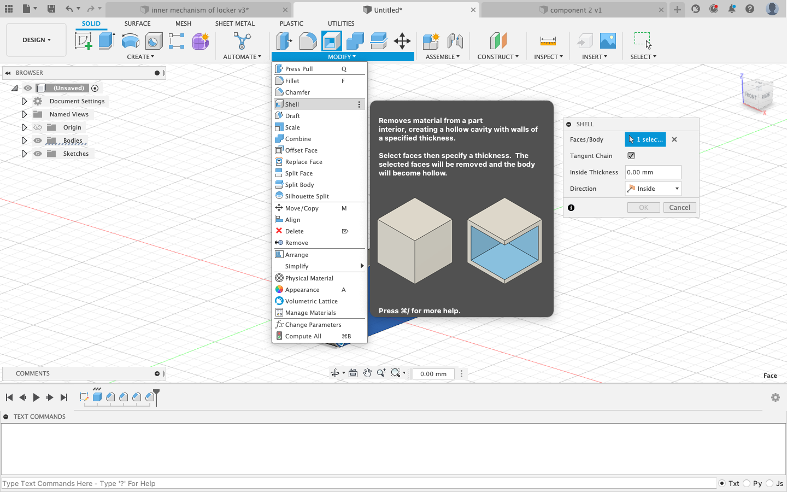
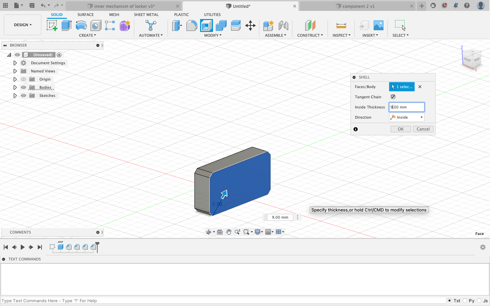
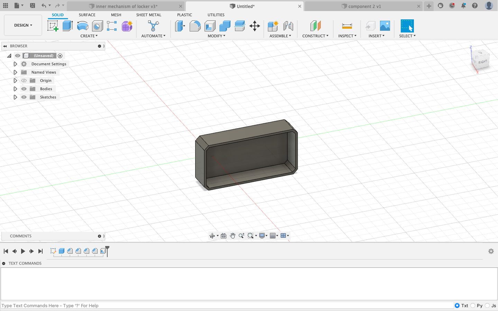
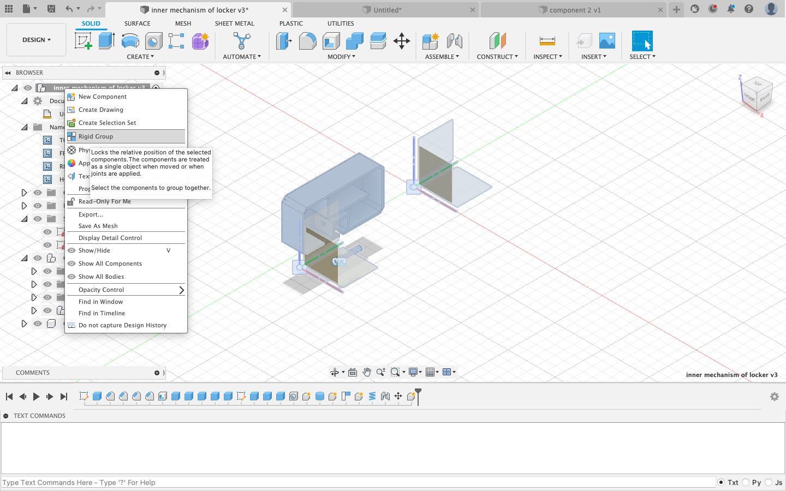
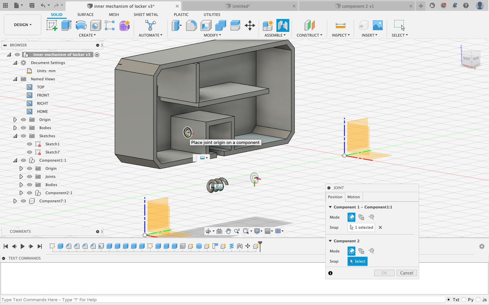
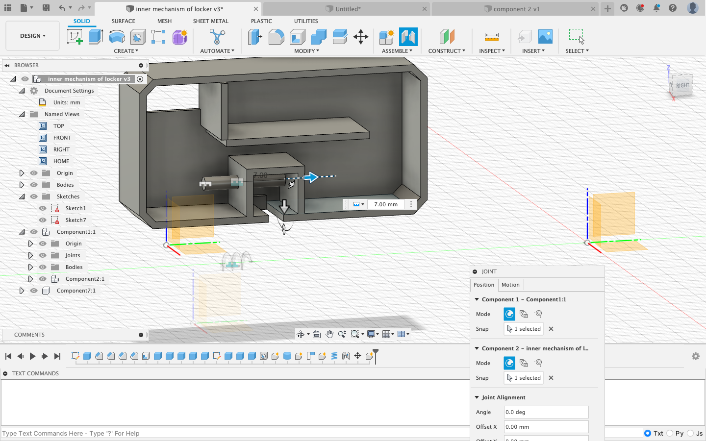

<h1 style="text-align:justify; font-size:2vw; text-align:center;" > Cad Design </h1>
<h2 style="text-align:justify; font-size: 1.5vw; text-align:center;" > Welcome to our project </h1>
   

### Assemble Cad Design and Procedure

<iframe src="https://myhub.autodesk360.com/ue28cacf9/shares/public/SH35dfcQT936092f0e43fec32ea03667fe3c?mode=embed" width="640" height="480" allowfullscreen="true" webkitallowfullscreen="true" mozallowfullscreen="true" frameborder="0"></iframe>

<h3 align="left"><u>How to design in Fusion step by step</u></h3>

<b>STEP 1:New Design</b> 
Open Fusion>file>new design

<b>STEP 2:Create a box</b> 
Select axis> 

solid>create>box

<b>STEP 3:Specify the dimensions</b> 
Clicking + hold>drag from a corner  
Specify dimensions: length 44 mm, press tab,  width 22 mm> click "enter"

<b>Step 4:Extrude</b> 
Click + hold>drag>Extrude  
Height 10 mm

<b>Step 5:Bevel the corners</b> 
Select an edge>Modify>chamfer>choose 2 mm>do it for 4 edges

<b>Step 6:Shell</b> 
utilities>modify>shell: the body becomes hollow 
choose 9 mm

<b>Step 7:Create the inside walls</b> 
-Same as steps 2 to 4 
-Specify the dimensions: length 10 mm, width 1 mm , height 22 mm> and in the dialog box> operation>join

<b>Step 8:Create a square hole for the Digital Fingerprint  Reader component</b> 
Specify the dimensions and and in the dialog box> operation>cut

<b>Step 9:Create a hole</b> 
solid>create>hole and specify the dimensions: here diameter 2 mm

<b>Step 10:Create a rode</b> 
solid>create>cylinder and extrude: length 12.252 mm and diameter of 1.95 mm because has to go inside the hole of a diameter of 2 mm

<b>Step 11:Solid>create>coil</b> 
Specify the dimensions: loop length 55.441 mm and surface 41.595 mm^2

<b>Step 12:Assemble the rod with the case</b> 
-Click on the original component in the browser:here “Inner mechanism of a locker” 
>dropdown>choose “rigid group”: locks the relative positions of the selected components

-Click on utilities>assemble>joint>select carefully the faces of each object we want to join in this case the case of the locker with the rod

-Push the rod inside by clicking and dragging

<b>Step 13:Assemble the coil with the inserted rod</b> 
Click on utilities>assemble>joint>select carefully the faces of each object we want to join in this case the coil with the inserted rod

#### Golf Ball

  

    
    
The filling was 50% when setting up the printer

  

  

    
    
The filling was 85% when setting up the printer

  

  

    
    
The filling was 95% when setting up the printer

  

  

    
    
The filling was 100% when setting up the printer

  

#### Smart Locker by Andry Eric

  

    
Freshly imported from Fusion into Flashprint the .3mF format. Need to make sure that everything is allright before uploading to the printer

  

  

 
    
Printing starts when the temperature reaches 210 

  

  

  
    
In the Guilder II series 3D printer. The filling was 15% when setting up the printer

  

  

  
    
Even using Arduino Nano IOT we will need to scale up the box case a little...

  

### Screw Jack

  

    
    
Screw Jack Model

  

  

    <a target="_blank" href="img/31.jpg">
    <video width="320" height="240" poster="img/31.jpg" controls>
   <source src="img/32.mp4" type="video/mp4">
   <source src="movie.ogg" type="video/ogg">
    </a>
    
End Printing

  

  

    <a target="_blank" href="img/33.jpg">
    <video width="320" height="240" poster="img/31.jpg" controls>
   <source src="img/33.mp4" type="video/mp4">
   <source src="movie.ogg" type="video/ogg">
</video>
    </a>
    
removing out the plate and sapport 

  

