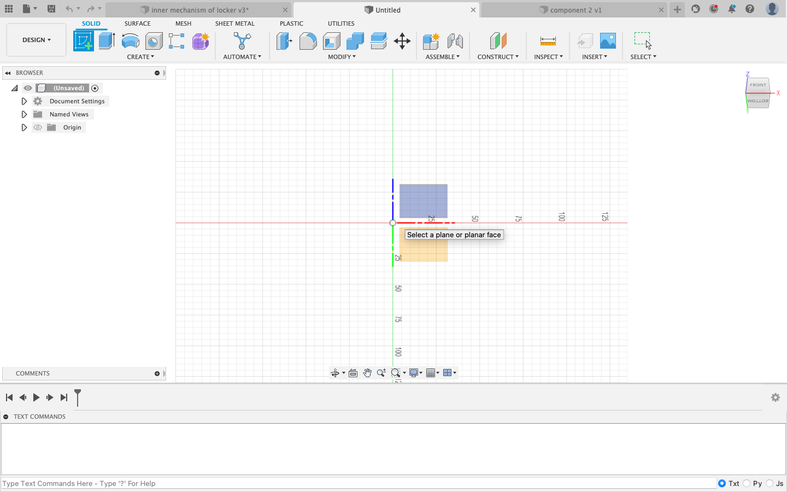
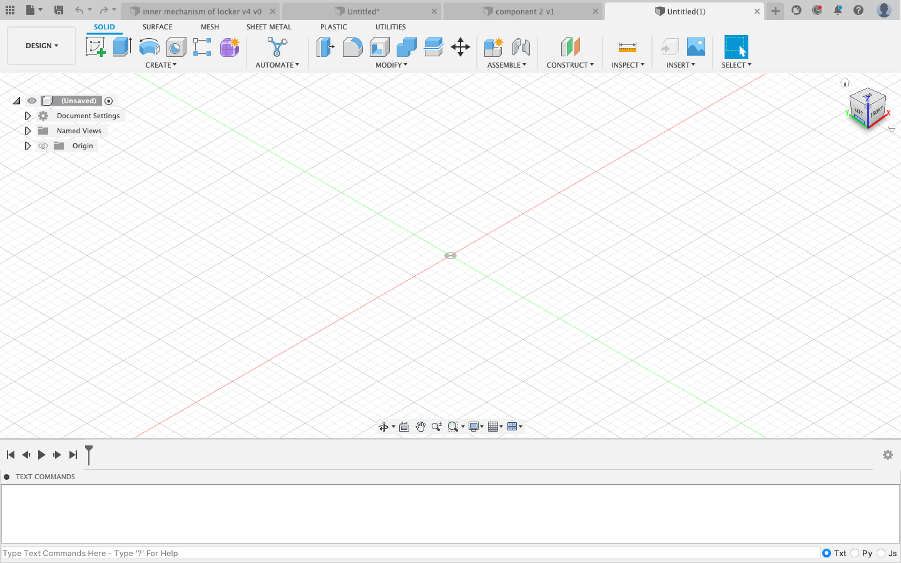
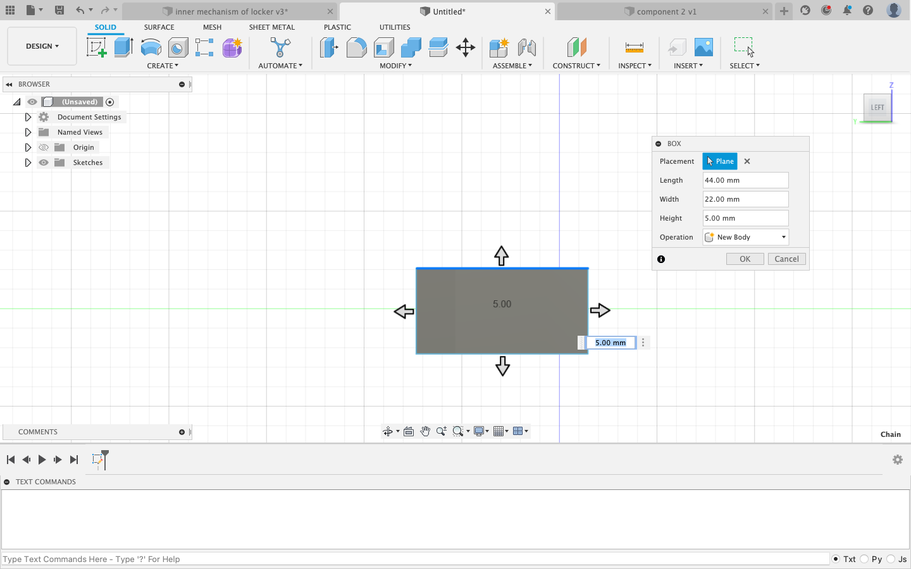
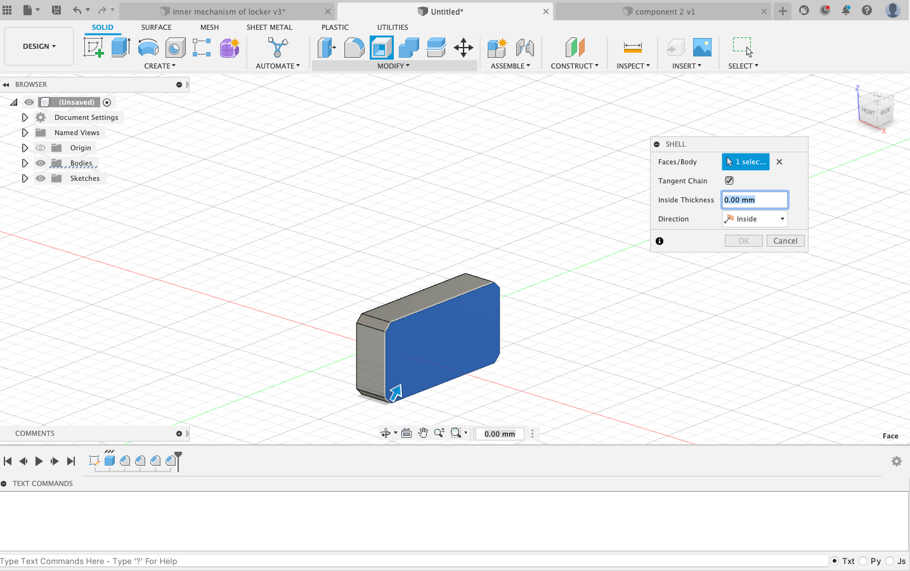
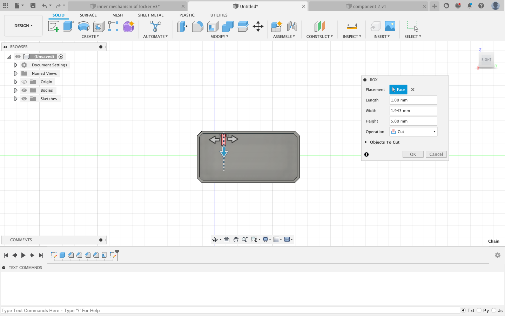
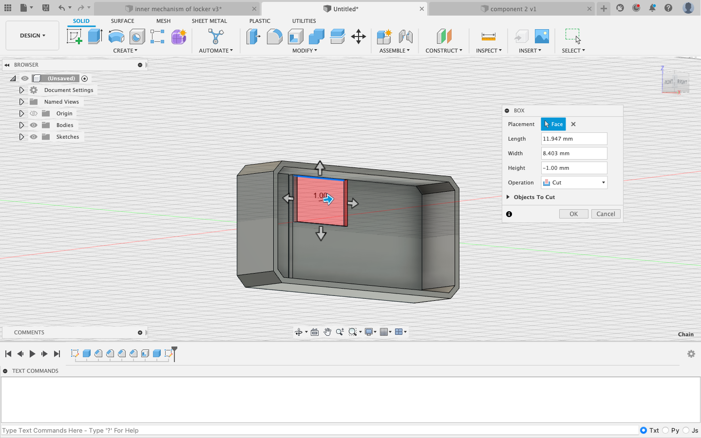
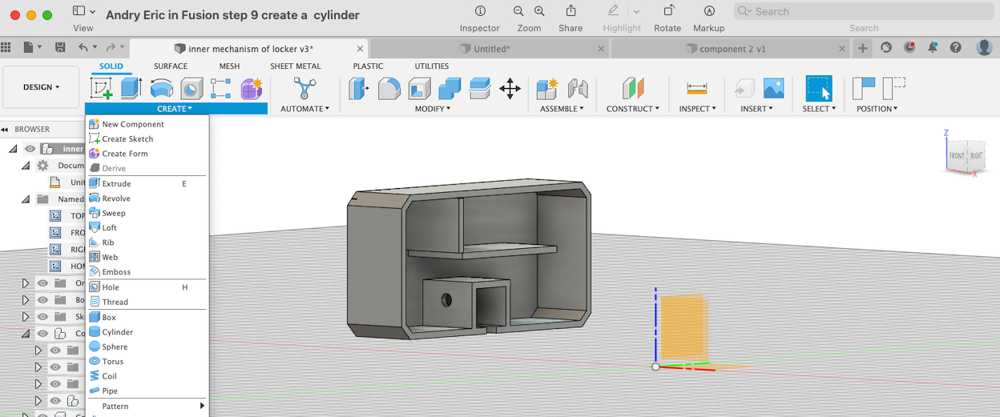
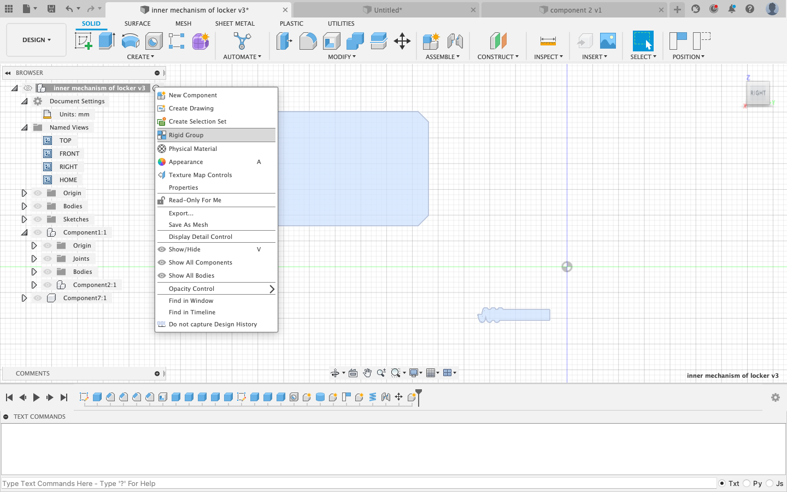
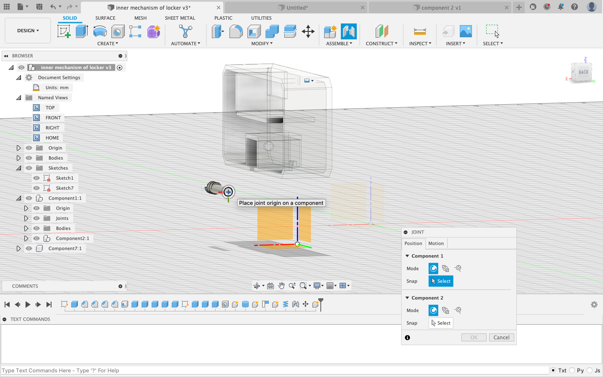
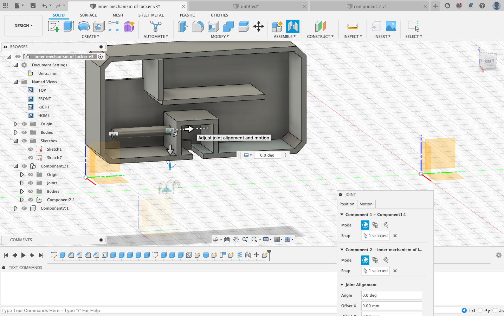

<h1 style="text-align:justify; font-size:2vw; text-align:center;" > Cad Design </h1>
<h2 style="text-align:justify; font-size: 1.5vw; text-align:center;" > Welcome to our project </h1>
   

### Assemble Cad Design and Procedure

<iframe src="https://myhub.autodesk360.com/ue28cacf9/shares/public/SH35dfcQT936092f0e43fec32ea03667fe3c?mode=embed" width="640" height="480" allowfullscreen="true" webkitallowfullscreen="true" mozallowfullscreen="true" frameborder="0"></iframe>

<h3 align="left"><u>How to design in Fusion step by step</u></h3>

<b>STEP 1:New Design</b> 
Open Fusion>file>new design

<b>STEP 2:Create a box</b> 
Select axis> 

solid>create>box

<b>STEP 3:Specify the dimensions</b> 
Clicking + hold>drag from a corner  
Specify dimensions: length 44 mm, press tab,  width 22 mm> click "enter"

<b>Step 4:Extrude</b> 
Click + hold>drag>Extrude  
Height 10 mm

<b>Step 5:Bevel the corners</b> 
Select an edge>Modify>chamfer>choose 2 mm>do it for 4 edges

<b>Step 6:Shell</b> 
utilities>modify>shell: the body becomes hollow 
choose 9 mm

<b>Step 7: Create the inside walls</b> 
- Same as steps 2 to 4 
- Specify the dimensions: length 10 mm, width 1 mm , height 22 mm> and in the dialog box> operation>join

<b>Step 8:Create a square hole for the Digital Fingerprint  Reader component</b> 
Specify the dimensions and and in the dialog box> operation>cut

<b>Step 9:Create a hole</b> 
solid>create>hole and specify the dimensions: here diameter 2 mm

<b>Step 10:Create a rode</b> 
solid>create>cylinder and extrude: length 12.252 mm and diameter of 1.95 mm because has to go inside the hole of a diameter of 2 mm

<b>Step 11:Solid>create>coil</b> 
Specify the dimensions: loop length 55.441 mm and surface 41.595 mm^2

<b>Step 12:Assemble the rod with the case</b> 
-Click on the original component in the browser:here “Inner mechanism of a locker” 
>dropdown>choose “rigid group”: locks the relative positions of the selected components

-Click on utilities>assemble>joint>select carefully the faces of each object we want to join in this case the case of the locker with the rod

 Push the rod inside by clicking and dragging

<b>Step 13:Assemble the coil with the inserted rod</b> 
Click on utilities>assemble>joint>select carefully the faces of each object we want to join in this case the coil with the inserted rod

# Some Other Fusion

> ## by Abdiaziz Omar Hassan

<iframe src="https://myhub.autodesk360.com/ue2fba46f/shares/public/SH9285eQTcf875d3c53903b9d04fb3842395?mode=embed" width="1024" height="768" allowfullscreen="true" webkitallowfullscreen="true" mozallowfullscreen="true"  frameborder="0"></iframe>

## by Mohamed Khaled

<iframe src="https://myhub.autodesk360.com/ue28cacf9/shares/public/SH35dfcQT936092f0e43b14627f50a6167e7?mode=embed" width="300" height="280" allowfullscreen="true" webkitallowfullscreen="true" mozallowfullscreen="true"  frameborder="0"></iframe>

### Process
**1st Step** Click Creat then  select Circle then creat a circle with 200mm and center small circle inside circle 40 mm then Extrode 30 mm
  

  

**2nd Step**
  

  

**3rd Step**
  

  

**4th Step**
  

  

**5th Step** :  Finish the Sketch 
  

  

**6th Step**
  

  

**7th Step**
  

  

**8th Step**  Finish the Sketch 
  

  

**9thStep** : 
  

  

**10th Step**
  

  

**11th Step**
  

  

## by Winkee

<iframe src="https://myhub.autodesk360.com/ue28cacf9/shares/public/SH35dfcQT936092f0e43efa7ca21b2232176?mode=embed" width="640" height="480" allowfullscreen="true" webkitallowfullscreen="true" mozallowfullscreen="true"  frameborder="0"></iframe>
  
<iframe src="https://myhub.autodesk360.com/ue28cacf9/shares/public/SH35dfcQT936092f0e43eb87905180cdbab7?mode=embed" width="640" height="480" allowfullscreen="true" webkitallowfullscreen="true" mozallowfullscreen="true"  frameborder="0"></iframe>

## By Peter

#### Golf Ball 

<iframe src="https://myhub.autodesk360.com/ue28cacf9/shares/public/SH35dfcQT936092f0e430700ac2bb3369af7?mode=embed" width="640" height="480" allowfullscreen="true" webkitallowfullscreen="true" mozallowfullscreen="true"  frameborder="0"></iframe>

Autodesk Fusion 360 showing how to design a golf ball.

  

  

Tools used in this tutorial are

1. Revolve
 

  

  

 
2. Extrode

  

 
3. Pattern

  

  

  

  

4. Shell
  

  
5. Mirror
  

  

6. Combine
  

  

