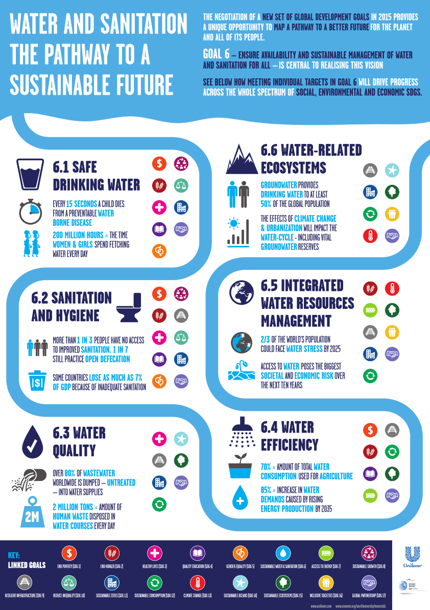
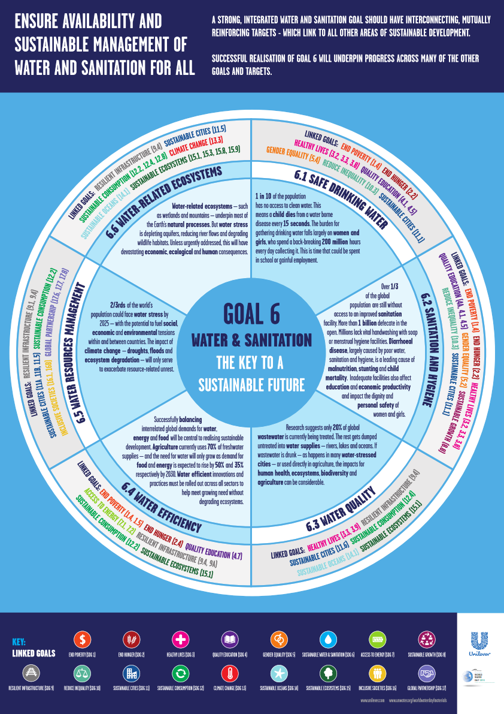

<h1 style="font-size:1.5vw;">

Water Quality Project  
 </h1>
<h1 style="font-size:1.4vw; text-align:center" >🧠Innovation and SDG<h1>

<h3 style="font-size:1.8vw; text-align:left" >SDG<h3>
  

Context:

In many regions of the world, especially in rural areas, water quality is a common issue and often the cause of diseases, and prematures deaths that could be avoided by a routine monitoring of the water quality.
The goal is to monitor the quality of water in (our own residences as well as villages’ wells), whether every household has an individual well like in China, or if the well belongs to a communal village like In Africa or any other nation. Remote and automated monitoring should be used. Our system will then send an SMS/email to the personnel in charge at the water management facility who are in charge of monitoring that specific asset but are not present. This SMS/email would include data for personnel use, as well as an analysis of various parameters. No need for the personnel to come to perform on site analysis.

Concept: 

Common chemical parameters include pH, nitrates and dissolved oxygen. Measuring <b>O2</b> (or <b>DO</b>) is
an important gauge of water quality. Changes in dissolved oxygen levels indicate the presence of microorganisms from sewage, urban or agriculture runoff or discharge from factories. A right level of ORP minimizes the presence of microorganisms such as E. coli, Salmonella, Listeria. Levels of
Turbidity below 1 NTU indicates the right purity of drinking water.
Other water quality parameters measured using g sensors include pH, dissolved oxygen (DO), oxidation-reduction potential (<b>ORP</b>), conductivity (salinity), turbidity, temperature and dissolved ions (Fluoride  (<b>F–</b>)), Calcium (<b>Ca2+</b>), Nitrate (<b>NO3–</b>), Chloride (Cl–), Iodide (<b>I–</b>), Cupric (<b>Cu2+</b>), Bromide (<b>Br–</b>), Silver (<b>Ag+</b>), Fluoroborate (<b>BF4–</b>), Ammonia (<b>NH4</b>), Lithium (<b>Li+</b>), Magnesium (<b>Mg2+</b>), Nitrite (<b>NO2-</b>), Perchlorate (<b>ClO4</b>), Potassium (<b>K+</b>), Sodium (<b>Na</b>).

  
1 / 2

  
  
SDG 6 Goals

  
2 / 2

  
  
The Key A Sustainbale Future

<a class="prev" onclick="plusSlides(-1)">❮</a>
<a class="next" onclick="plusSlides(1)">❯</a>

 
<!-- 
 -->

Function:
 

For different purposes, different parameters will be monitored by our system.  
- <b>drinking water quality control </b>: Calcium (Ca2+), Iodide (I–), Chloride (Cl–), Nitrate (NO3–), pH.  
- <b>agriculture water monitoring,</b>: Calcium (Ca2+), Nitrate (NO3–), pH.  
-<b>waste water treatment</b>: may need to be performed according to the circumstances, if certain levels
of Cupric (Cu2+), Silver/Sulfide (Ag+/S2-), Lead (Pb2+), Fluoroborate (BF4–), and a reading of
abnormal pH is noticed

<!--  -->
<!--  -->

  
  

   

<b> <a href="https://www.un.org/sustainabledevelopment/water-action-decade/">Water Action Decade, 2018-2028</a></b>
40 per cent shortfall in freshwater resources by 2030 coupled with a rising world
population has the world careening towards a global water crisis. Recognizing the growing challenge of water scarcity the UN General Assembly launched the<a href=" https://www.wateractiondecade.org/"> Water Action Decade</a> on 22 March 2018, to mobilize action that will help transform how we manage water.

<!-- 

<b> <a href="https://www.un.org/sustainabledevelopment/water-action-decade/">Water Action Decade, 2018-2028</a></b>
40 per cent shortfall in freshwater resources by 2030 coupled with a rising world
population has the world careening towards a global water crisis. Recognizing the growing challenge of water scarcity the UN General Assembly launched the<a href=" https://www.wateractiondecade.org/">Water Action Decade, 2018-2028</a> on 22 March 2018, to mobilize action that will help transform how we manage water.
 -->

Design:

The measurement of these parameters will assist the villagers in their daily activities and will serve
different purposes: 
- if the water is drinkable “BLUE ” color will be displayed on a small LCD along with the message
“drinkable” in the local language of the village community  : they can either use it for drinking, cooking…., or either store it for later usage
- if the water is suitable for agricultural purposes a “ GREEN ” color” will be displayed along with the message “agriculture”: indicating then they can readily use it for that purpose  
- if the water is neither suitable for drinking or agricultural purposes a “ RED ” color will be
displayed along with a pulsating message “DO NOT USE - WAIT ”, then it will indicate that either the water requires some treatment or that the users will just have to wait until the light turns either blue or green before using the water. This warning will be accompanied by a sound alert, so that to
provide an additional warning to the putative user.

 <h3 style="font-size:1.4vw; text-align:Left" >🧠Innovation<h1>
    
 

 Compared to other existing systems our system is <b>remote</b> and doesn’t require the water management facility in charge of monitoring that particular asset to send anyone on site for routine analysis. Only when a treatment is required or for the maintenance of the device will they have to do so. The analysis will also be <b>performed routinely</b> every minuts. 

Water Quality Project 
 

  <video style="align:center" width="580" height="240" poster="img/download.png" controls>
   <source src="img/imgproj/TestingProject.mp4" type="video/mp4">
   <source src="movie.ogg" type="video/ogg">
</video>

 

  <video style="align:center" width="580" height="240" poster="img/download.png" controls>
   <source src="img/imgproj/TestingProject2.mp4" type="video/mp4">
   <source src="movie.ogg" type="video/ogg">
</video>

